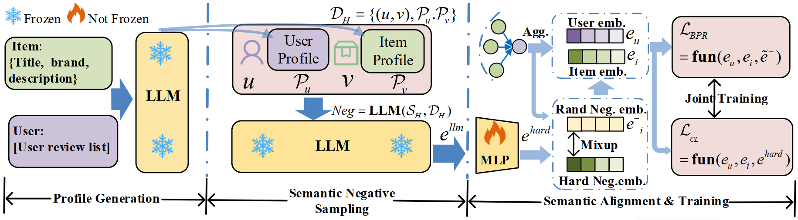

# Can LLM-Driven Hard Negative Sampling Empower Collaborative Filtering? Findings and Potentials.

<p align="center">

</p>

This paper introduces the concept of Semantic Negative Sampling and explores how to optimize LLMs for 
high-quality, hard negative sampling. Specifically, we design an experimental pipeline that includes 
three main modules: profile generation, semantic negative sampling, and semantic alignment, to verify 
the potential of LLM-driven challenging negative sampling in enhancing the accuracy of collaborative 
filtering (CF). Further analysis reveals that this gap primarily arises from two major challenges: 
semantic shift and lack of behavioral constraints. To address these challenges, we propose a framework
called **HNLMRec**, which is based on fine-tuning LLMs supervised by collaborative signals.
Experimental results show that this framework outperforms traditional negative sampling and other
LLM-driven recommendation methods across multiple datasets, providing new solutions for empowering 
traditional RS with LLMs.

## 📝 Environment
```bash
pip install numba==0.53.1
pip intall numpy==1.20.3
pip install scipy==1.6.2
pip install torch>=1.7.0
```

## 📈 Dataset Information and Processing Details

In our paper, we conducted experiments using four datasets ( Toys & Games, CDs & Vinyl, 
Yelp2018, Amazon Electronics 2023), among which the Amazon Fashion dataset was primarily 
used to validate the generalization capability of the fine-tuned model on new datasets. 
The statistical information for all datasets is presented in the table below:

|         Dataset         | #Users | #Items | #Interactions |  Density   |
|:-----------------------:|:------:|:------:|:-------------:|:----------:|
|      Toys & Games       | 22,338 | 9,023  |    200,511    | 1.0 × 10⁻³ |
|       CDs & Vinyl       | 19,385 | 8,279  |    186,535    | 1.2 × 10⁻³ |
|        Yelp2018         | 29,832 | 16,781 |    513,976    | 1.0 × 10⁻³ |
| Amazon Electronics 2023 | 97,570 | 44,669 |    178,259    | 4.1 × 10⁻⁷ |

For the Toys & Games dataset, we first filtered out interactions with ratings below 4 
and selected records within the date range from 2015-01-01 to 2018-01-01. Additionally,
we retained only users and items with at least 10 interactions. For the CDs & Vinyl 
dataset, we selected records within the date range from 2014-01-01 to 2016-01-01, with
the remaining processing steps consistent with the above. For the Yelp2018 dataset, 
we selected records within the date range from 2015-01-01 to 2018-01-01, with the
remaining processing steps also consistent with the above. As for the Amazon 
Electronics 2023 dataset, we retained only interactions with ratings of 3 or higher,
within the date range from 2010-01-01 to 2018-01-01.

## 🔬 Model Training and Inference

The pipeline of our model primarily consists of three parts: **user-item profile generation**, 
**semantic negative sampling**, and **semantic alignment and Training**.

```
|--- dataset_process
|    |--- hard_negative_generation
|    |    |--- negative_sample_generation.py  
|    |    |--- negative_sample_prompt_S_H.txt  
|    |    |--- negative_sample_to_emb.py  
|    |    |--- hard_negative_sampling_embeddings
|    |        |--- negative_samples_with_fn.py  
|    |--- item_profile_generation
|    |    |--- item_generation.py  
|    |    |--- item_system_prompt_S_v.txt  
|    |--- user_profile_generation
|         |--- user_generation.py  
|         |--- user_system_prompt_S_u.txt  
|--- model
|    |--- model_fine_tuning  
|    |--- model_training  
|    |--- model_pipeline.jpg  
|--- README.md  
```

***
### User Profile and Item Profile Generation (e.g., Yelp2018)

For the **item profile** generation, you need first to contract such json file, which is shown as follows:
```
{
        "item_id": row['item_id'],
        "name": row['name'],  
        "city": row["city"], 
        "categories": row['category'],
}
```
You can then run the following code in `./dataset_process/item_profile_generation/` to generate item profiles:
```
python item_generation.py
```
we can get the follow such an output:
```
{
    "item_id": "-0TffRSXXIlBYVbb5AwfTg",
    "summarization": "Young adults, especially those in their 20s and 30s who are looking for
                    a unique dining experience with a modern twist on traditional Indian food, 
                    may enjoy IndeBlue. Additionally, individuals seeking a fun night out with 
                    friends or a special occasion celebrationwould also be a good fit.",
    "reasoning": "The business's categories include Cocktail Bars, Nightlife, and Event Planning & Services,
                  indicating that it caters to young adults who are looking for a lively atmosphere. The user 
                  feedback highlights the restaurant's modern take on traditional Indian food, which may appeal
                  to those seeking something new and exciting. Furthermore, several users mention enjoying happy hour specials, 
                  live music, and a fun night out with friends, suggesting that IndeBlue is suitable for groups of 
                  young adults."
},
```
***
For the generation of **user profiles**, readers also need to construct the input JSON, as shown below:

```
items.append({
            "title": row['title'],
            "description": row['description'],
            "review": row['review_text']
        })
{
  "user_id": user_id, 
  "prompt": "PURCHASED PRODUCTS: \n" + json.dumps(items, ensure_ascii=False, indent=4)
}
```
Then you can run the following code in `./dataset_process/user_profile_generation/` to generate user profiles:
```
python user_generation.py
```
we can get the follow such a user profile output:
```
 {
        "user_id": "-0H6Rm6dCi3pkFBC26HsoQ",
        "summarization": "This user likely enjoys casual, family-friendly dining experiences with good 
                          food and service. They also appreciate traditional barbecue, Southern comfort 
                          food, and hearty breakfast options.",
        "reasoning": "Based on the reviews provided, it appears that this user values generous portions, 
                      good deals, and a comfortable atmosphere. They seem to enjoy a variety of cuisines, 
                      including Italian, BBQ, and Southern comfort food. The tone of their reviews suggests 
                      a casual and enthusiastic approach to dining experiences."
 }
```
***
### Hard Negative Sampling
The paper proposes two negative sampling methods: (1)the first directly generates hard negative samples for 
user-item interaction pairs. (2) the second leverages collaborative signals 
to supervise the fine-tuning of LLMs, thereby directly generating hard negative sample embeddings.

- The first method for generating hard negative samples primarily consists of two steps: first, 
  generating textual descriptions of the hard negative samples, and then converting the text into embeddings.
  
  First, you need to construct the input data in JSON format:
  ```
  {
          f'USER INFORMATION: \n{{\n"user_id": "{row["user_id"]}", \n"user_profile": "{user_profile}"\n}}\n'
          f'INTERACTED PRODUCT: \n{{\n"item_id": "{row["item_id"]}", \n"title": "{title}", \n"item_profile": "{item_profile}"\n}}'
  }
  ```
  Then run the following in `dataset_process/hard_negative_generation` code to obtain the titles of the hard negative samples：
  ```
  python negative_sample_generation.py
  ```
  Finally, run the following code to obtain the text embeddings.
  ```
  python negative_sample_to_emb.py
  ```
- For the second method, you first need to construct the JSON-formatted data required for fine-tuning. 
  After fine-tuning the LLM, use the LLM to directly output the embeddings of hard negative samples for users.
  
  The json data format required for fine-tuning is as follows:
  ```
  { 
   Query: {[user_emebdings], user prfile,\n [item_embeddings]
   Pos: [hard negative emebdings]
   Neg: [item_emebeddings]
   } 
  }
  ```
 Fine-tuning is performed by running the files under `model/model_fine_tuning`:
 ```bash
 sh embeddings_training.sh
 ```
 Run the code in `./dataset_process/hard_negative_sampling_embeddings` to obtain hard negative sample embeddings.
 ```
 python negative_samples_with_fn.py
 ```

---
### Training
After obtaining the hard negative sample embeddings, you can run the following code 
in `model_structure/model_trianing/` to train recommendation models and infer:
```
python  main.py --model LightGCN --gpu 1
```

The model parameters can be adjusted by modifying the `[model_name].yaml` file located in `model_structure/model/training/conf`.

---
## 📡 Citation

## 👏 Acknowledgement

We would like to extend our special thanks to the authors of [RLMRec](https://github.com/HKUDS/RLMRec) 
and [SELFRec](https://github.com/Coder-Yu/SELFRec), as our code implementation partially relies on 
these frameworks. We have duly cited their work in our paper. Additionally, the framework for 
fine-tuning our model is implemented based on this [repo](https://github.com/yuanzhoulvpi2017/SentenceEmbedding).

