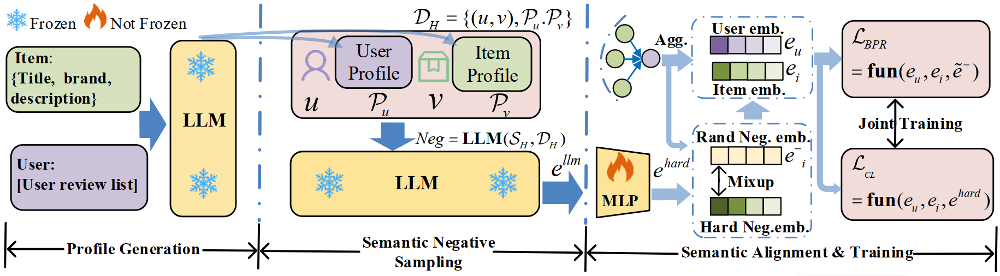

# Can LLM-Driven Hard Negative Sampling Empower Graph Collaborative Filtering? Findings and Potentials.

<p align="center">

</p>

This paper introduces the concept of Semantic Negative Sampling and explores how to optimize LLMs for 
high-quality, hard negative sampling. Specifically, we design an experimental pipeline that includes 
three main modules: profile generation, semantic negative sampling, and semantic alignment, to verify 
the potential of LLM-driven challenging negative sampling in enhancing the accuracy of collaborative 
filtering (CF). Further analysis reveals that this gap primarily arises from two major challenges: 
semantic shift and lack of behavioral constraints. To address these challenges, we propose a framework
called **HNLMRec**, which is based on fine-tuning LLMs supervised by collaborative signals.
Experimental results show that this framework outperforms traditional negative sampling and other
LLM-driven recommendation methods across multiple datasets, providing new solutions for empowering 
traditional RS with LLMs.

## 📝 Environment
```bash
pip install numba==0.53.1
pip intall numpy==1.20.3
pip install scipy==1.6.2
pip install torch>=1.7.0
```

## 📈 Dataset Information and Processing Details

In our paper, we conducted experiments using four datasets ( Toys & Games, CDs & Vinyl, 
Yelp2018, Amazon Electronics 2023), among which the Amazon Fashion dataset was primarily 
used to validate the generalization capability of the fine-tuned model on new datasets. 
The statistical information for all datasets is presented in the table below:

|         Dataset         | #Users | #Items | #Interactions |  Density   |
|:-----------------------:|:------:|:------:|:-------------:|:----------:|
|      Toys & Games       | 22,338 | 9,023  |    200,511    | 1.0 × 10⁻³ |
|       CDs & Vinyl       | 19,385 | 8,279  |    186,535    | 1.2 × 10⁻³ |
|        Yelp2018         | 29,832 | 16,781 |    513,976    | 1.0 × 10⁻³ |
| Amazon Electronics 2023 | 97,570 | 44,669 |    178,259    | 4.1 × 10⁻⁷ |

For the Toys & Games dataset, we first filtered out interactions with ratings below 4 
and selected records within the date range from 2015-01-01 to 2018-01-01. Additionally,
we retained only users and items with at least 10 interactions. For the CDs & Vinyl 
dataset, we selected records within the date range from 2014-01-01 to 2016-01-01, with
the remaining processing steps consistent with the above. For the Yelp2018 dataset, 
we selected records within the date range from 2015-01-01 to 2018-01-01, with the
remaining processing steps also consistent with the above. As for the Amazon 
Electronics 2023 dataset, we retained only interactions with ratings of 3 or higher,
within the date range from 2010-01-01 to 2018-01-01.

## 🔬 Model Training and Inference

The pipeline of our model primarily consists of three parts: user-item profile generation, 
semantic negative sampling, and semantic alignment.

### User Profile and Item Profile Generation
For the item profile generation, you need first to contract such json file, which is shown as follows:
```
{
        "item_id": row['item_id'],
        "name": row['name'],  
        "city": row["city"], 
        "categories": row['category'],
}
```
Then you can run follow code to generate Item profile:
```bash
python ./dataset_process/item_profile_generation/item_generation.py
```
we can get the follow such an output:
```
{
    "item_id": "-0TffRSXXIlBYVbb5AwfTg",
    "summarization": "Young adults, especially those in their 20s and 30s who are looking for
     a unique dining experience with a modern twist on traditional Indian food, may enjoy IndeBlue. 
     Additionally, individuals seeking a fun night out with friends or a special occasion celebration
      would also be a good fit.",
    "reasoning": "The business's categories include Cocktail Bars, Nightlife, and Event Planning & Services,
     indicating that it caters to young adults who are looking for a lively atmosphere. The user feedback 
     highlights the restaurant's modern take on traditional Indian food, which may appeal to those seeking 
     something new and exciting. Furthermore, several users mention enjoying happy hour specials, 
     live music, and a fun night out with friends, suggesting that IndeBlue is suitable for groups of 
     young adults."
},
```


### Hard Negative Sampling


### 

## 👏 Acknowledgement

We would like to extend our special thanks to the authors of [RLMRec](https://github.com/HKUDS/RLMRec) 
and [SELFRec](https://github.com/Coder-Yu/SELFRec), as our code implementation partially relies on 
these frameworks. We have duly cited their work in our paper. Additionally, the framework for 
fine-tuning our model is implemented based on this [repo](https://github.com/yuanzhoulvpi2017/SentenceEmbedding).